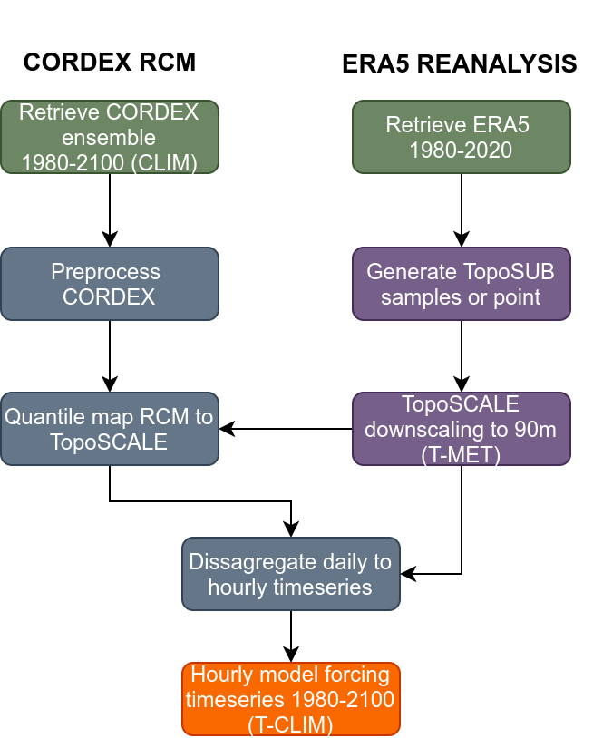

# TopoCLIM
Methods to downscale climate timeseries from CORDEX RCM data.

This scheme specifically addresses the need for hillslope scale atmospheric forcing timeseries for modeling the local impact of regional climate change projections on the land surface in complex terrain. The method has a global scope and is able to generate the full suite of model forcing variables required for hydrological and land surface modeling at hourly timesteps. 

It achieves this by utilising the previously published TopoSCALE scheme (Fiddes & Gruber, 2014) to generate a synthetic observation of current climate at hillslope scale, while accounting for a broad range of surface-atmosphere interactions. These synthetic observations are then used to debias (downscale) CORDEX climate variables using the quantile mapping method. A further temporal disaggregation step produces sub-daily fields. This approach has the advantages of other empirical-statistical methods, namely speed of use, while avoiding the need for ground data, which is often limited. It is therefore a suitable method for a wide range of remote regions where ground data is absent, incomplete, or not of sufficient length. The approach is evaluated using a network of high elevation stations across the Swiss Alps and a test application of modelling climate change impacts on Alpine snow cover is given. 

Please see the following discussion-paper for further details:

>Fiddes, J., Aalstad, K., and Lehning, M.: TopoCLIM: Rapid topography-based downscaling of regional climate model output in complex terrain v.1.0, Geosci. model Dev. Discuss. [preprint], https://doi.org/10.5194/gmd-2021-60, in review, 2021.


Figure 1: Overview of the main TopoCLIM processes.

## Getting started

### Installing the TopoCLIM Python module

To begin you'll need a copy of the source code. Either fork the TopoCLIM repository to your own github username, or clone directly.

```{bash}
git clone https://github.com/joelfiddes/topoCLIM.git
cd topoCLIM
```

It's recommended (but not essential) that you use some sort of python environment manager, such as using the Anaconda distribution and creating an environment (in the code below called "`tclim`"), or using `virtualenv` instead.  This getting started will use Anaconda.

Set up Python 3 env (Python >= 3.6 supported) and install Python packages in requirements.txt:

```{bash}
conda create -n tclim python=3.9
conda activate tclim
(tclim) pip install -r requirements.txt
```
Install R and R package dependencies:

```{bash}
sudo apt-get r-base
Rscript -e 'install.packages("ncdf4","qmap," repos="http://cran.us.r-project.org")'
```
Install ESGF client and dependencies for downloading CORDEX data:
```{bash}
conda install -c conda-forge esgf-pyclient
conda install -c conda-forge defusedxml
conda install -c conda-forge myproxyclient

```
Install Climate Data Operators (CDO) used in postprocessing CORDEX data:

```{bash}
conda install -c conda-forge cdo
```
### Running the example
A minimal example for a single point (WFJ) and two climate models is provided here including raw cordex and toposcale downscaled data so it can be run straight out of the box:

```
cd ./topoCLIM/tclim
python tclim_run.py ../examples/ ../examples/tscale ../examples/cordex/ 
```
## Running a TopoCLIM job

### Generate TopoSCALE timeseries

TopoSCALE is a separate python based package available at: https://github.com/joelfiddes/tscaleV2.git

We include a test TopoSCALE timeseries here in "/examples" for running and testing TopoCLIM.

### Download CORDEX

To access CORDEX data on the Earth System Grid Federation nodes credentials are required as described here:
https://esgf-data.dkrz.de/user/add/?next=http://esgf-data.dkrz.de/user/add/

CORDEX data is downloaded using the helper script:

```
python esgf_get.py cordex_domain openid output_dir
```

And postprocessed:
```
python esgf_post.py cordex_domain output_dir mydomain output_res
```
Currently the code requires historical, RCP 2.6 and RCP 8.5 scenarios. *esgf_get.py* is currently configured to obtain datsets required by TopoCLIM. Future work will focus on making these scenarios configurable.

### Run TopoCLIM
Now you should be able to run your TopoCLIM jobs: 

```
cd ./topoCLIM/tclim
python tclim_run.py workdir path2tscale path2cordex
```

Downscaled timeseries for each climate scenario and for each TopoSCALE point will be writted to the *workdir* under a folder structure corresponding to each TopoSCALE point.


